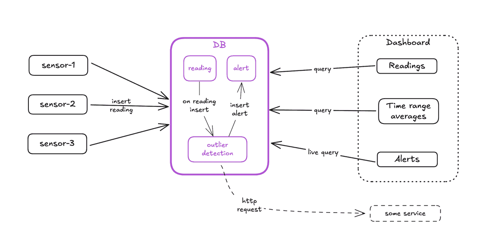
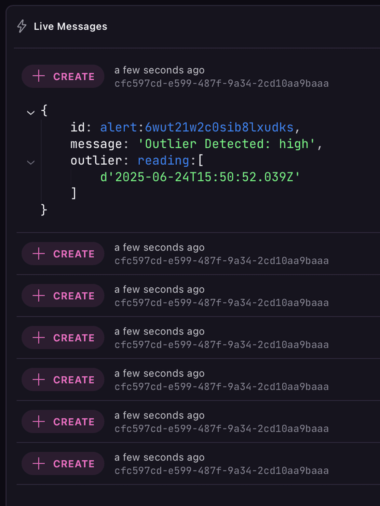
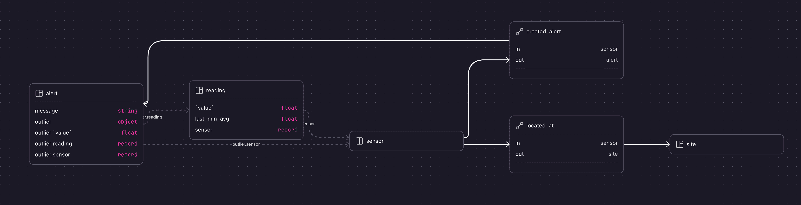

# Telemetry IoT Demo

> SurrealDB, time series, event triggers, graph



## Running

Start the DB with:

```sh
surreal start -u root -p root
```

Import the schema:

```sh
surreal import -e http://localhost:8000 -u root -p root \
    --namespace telemetry-simulator --database demo \
    surql/migrations/0.schema.surql
```

Add initial data:

```sh
surreal import -e http://localhost:8000 -u root -p root \
    --namespace telemetry-simulator --database demo \
    surql/migrations/1.initial_data.surql
```

Create the event trigger:

```sh
surreal import -e http://localhost:8000 -u root -p root \
    --namespace telemetry-simulator --database demo \
    surql/migrations/2.sensor_anomaly_alert.surql
```

Run the simulated devices with:

```sh
just sim
```

Run a live select to see alerts being raise in real time:

```sql
live select * from alert;
```



Graph queries:

```sql
-- Alerts per sensor
SELECT *, ->created_alert->alert FROM sensor;

-- Sensor locations
select *, ->located_at->site from sensor;
```


```sql
-- Alerts per site
SELECT
    id,
    <-located_at<-sensor->created_alert->alert.{message, outlier} AS alerts
FROM site
FETCH alerts;
```

## DB schema


